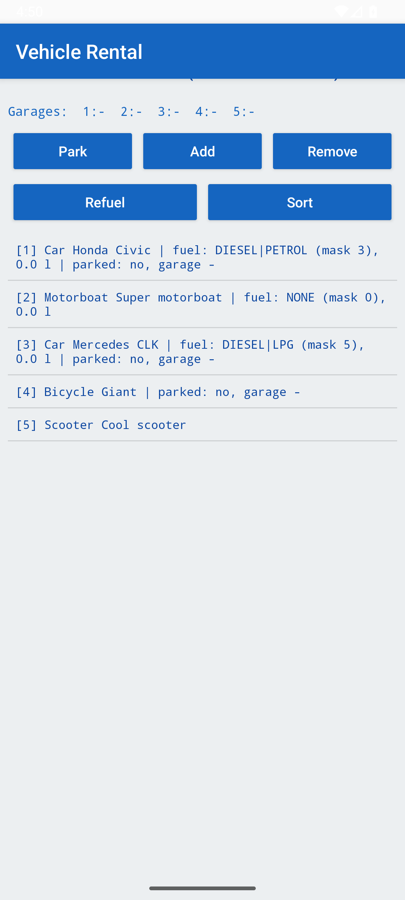
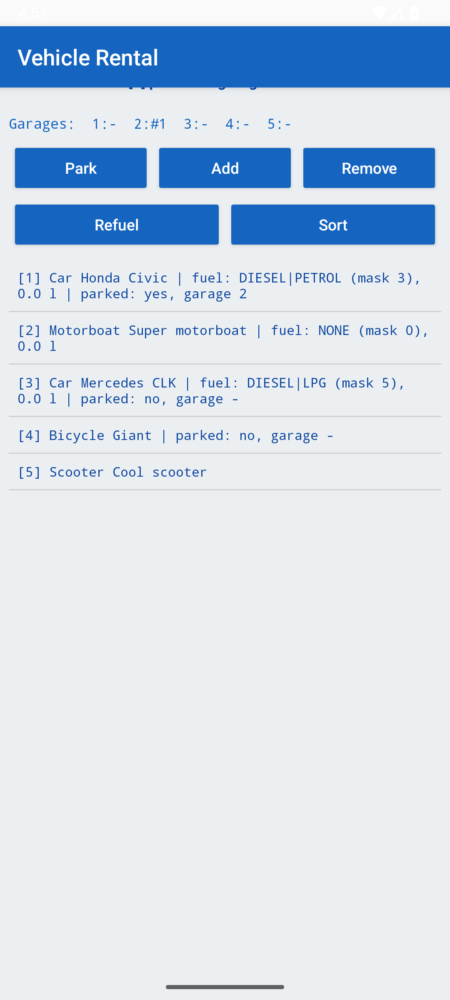
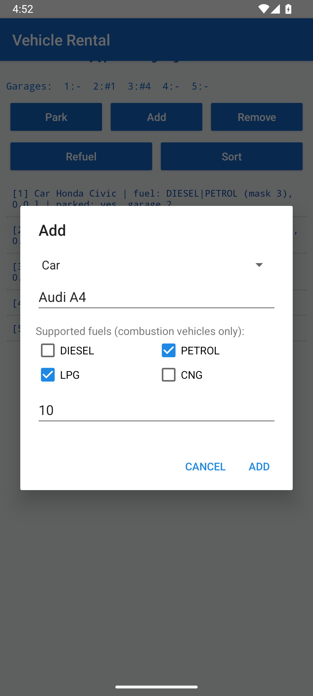
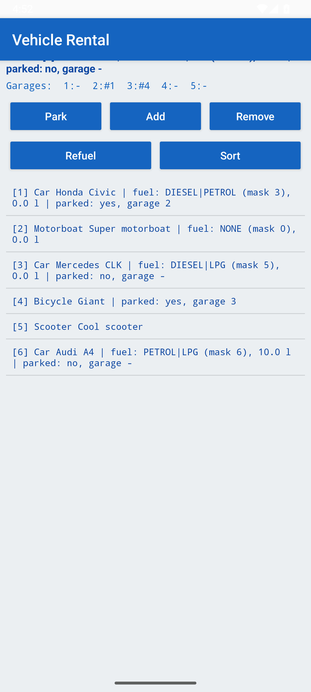
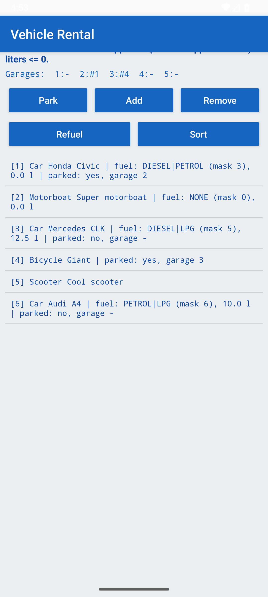
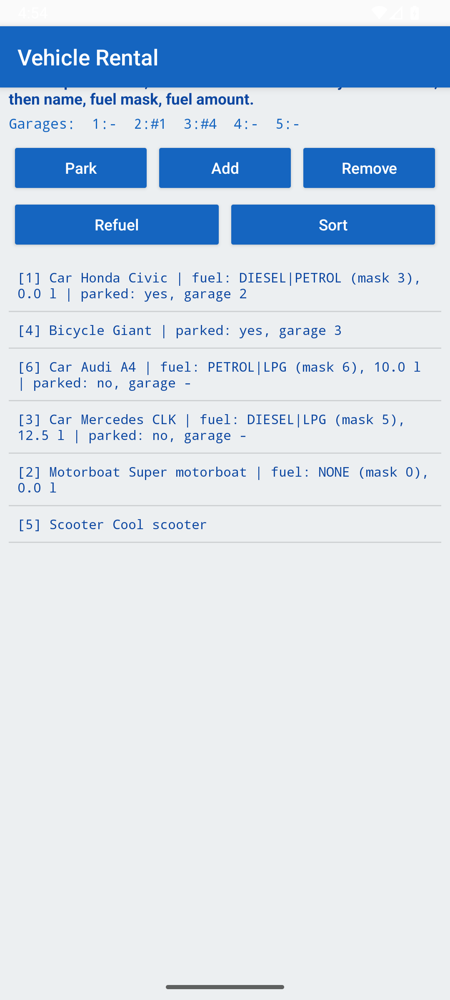
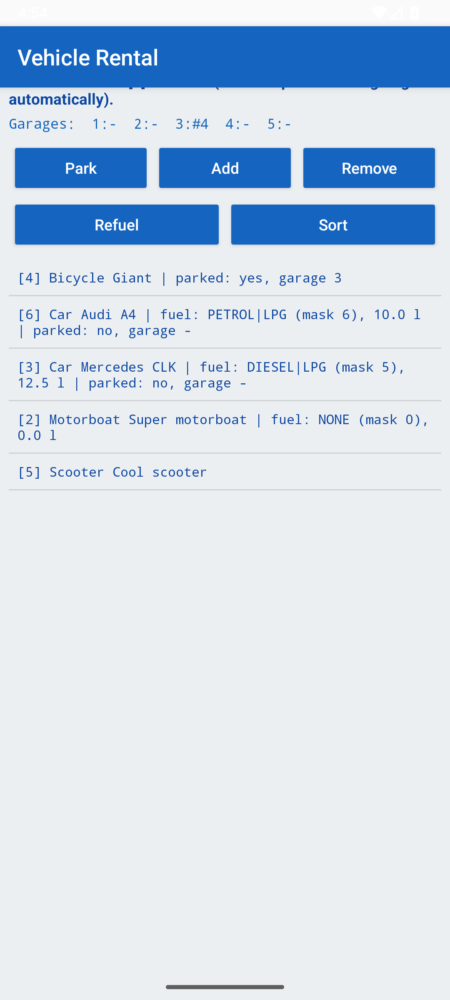
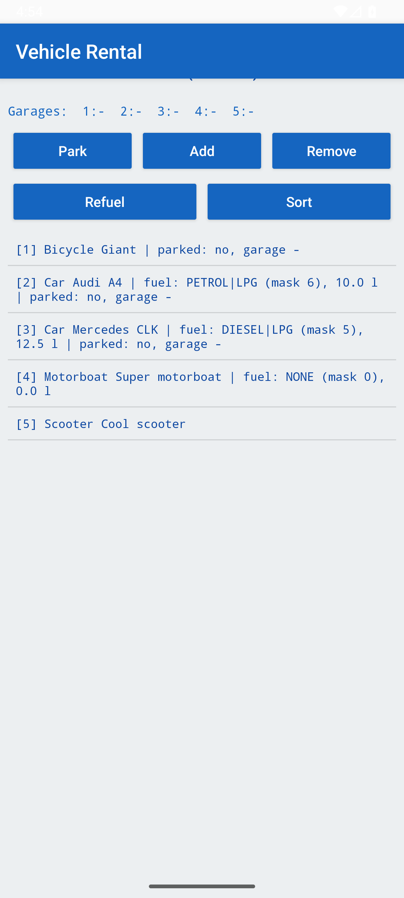

# Lab 4 — Interfaces: Vehicle Rental System (Android, Java)

- **Course:** Introduction to Mobile Systems
- **Lab number:** 4
- **Student:** Hasan Yilmaz
- **Student ID:** 56505

**Description:** An object-oriented vehicle rental app (Java) built with an abstract `Vehicle` class, the `CombustionVehicle` and `Parkable` interfaces, inheritance and polymorphism. Vehicles are kept in an `ArrayList`, sorted with a multi-criteria comparator and persisted to XML, where fuel types are stored as an integer bitmask. The UI offers park/unpark, add, remove, refuel and sort operations with clear messages for every action.

Object-oriented vehicle rental implemented with an abstract class, interfaces, inheritance, polymorphism, `ArrayList`, multi-criteria sorting and XML persistence. The Android UI (buttons + dialogs) is the equivalent of the console menu.

## Domain model — every type in its own source file

| Type | Kind | Notes |
|---|---|---|
| [Vehicle](app/src/main/java/com/mertyilmaz/lab4/Vehicle.java) | abstract class | `private final int id`, `private String name`, `private static int nextId`; unique ID assigned automatically in the constructor (`id = nextId++`) for vehicles loaded from XML and created by the user |
| [Car](app/src/main/java/com/mertyilmaz/lab4/Car.java) | class | extends Vehicle, implements `CombustionVehicle` + `Parkable` |
| [Motorboat](app/src/main/java/com/mertyilmaz/lab4/Motorboat.java) | class | extends Vehicle, implements `CombustionVehicle`, not parkable |
| [Bicycle](app/src/main/java/com/mertyilmaz/lab4/Bicycle.java) | class | extends Vehicle, implements `Parkable`, no fuel |
| [Scooter](app/src/main/java/com/mertyilmaz/lab4/Scooter.java) | class | extends Vehicle only |
| [Garage](app/src/main/java/com/mertyilmaz/lab4/Garage.java) | class | `private final int number`, `private Parkable parkedVehicle` (null = empty) |
| [Rental](app/src/main/java/com/mertyilmaz/lab4/Rental.java) | class | `Rental(int garageCount)` — 5 garages in this assignment; park/unpark/add/remove/sort with clear user messages |
| [CombustionVehicle](app/src/main/java/com/mertyilmaz/lab4/CombustionVehicle.java) | interface | fuel **bitmask** constants + `refuel`, `getSupportedFuelMask`, `getFuelAmount` |
| [Parkable](app/src/main/java/com/mertyilmaz/lab4/Parkable.java) | interface | `park`, `unpark`, `isParked`, `getGarage` |
| [VehicleComparator](app/src/main/java/com/mertyilmaz/lab4/VehicleComparator.java) | class | the multi-criteria `Comparator<Vehicle>` used with `Collections.sort` |
| [XmlStorage](app/src/main/java/com/mertyilmaz/lab4/XmlStorage.java) | class | XML load/save (XmlPullParser / XmlSerializer) |

## Fuel bitmask & XML mapping (mandatory rule)

`DIESEL = 1<<0 (1)`, `PETROL = 1<<1 (2)`, `LPG = 1<<2 (4)`, `CNG = 1<<3 (8)` — a vehicle may support several fuels, e.g. `PETROL | LPG == 6`.

**Mapping rule (documented in `XmlStorage` and used identically for reading and writing):** the integer in the XML `fuelType` element *is* the bitmask — `3 = DIESEL|PETROL`, `5 = DIESEL|LPG`, `0 = no supported fuel`. Non-combustion vehicles (bicycle, scooter) have no `fuelType` element. On save the app additionally writes `fuelAmount` (documented extension) so fuel state survives a restart.

`refuel(fuelMask, liters)` returns `true` only when `liters > 0` and `(supportedMask & fuelMask) != 0`; otherwise nothing changes and it returns `false`.

## Parking rules

Each garage holds at most one `Parkable` vehicle; vehicle and garage keep references to each other and are updated together. `park` fails (with a clear reason) when the garage is occupied, the vehicle is already parked, or the vehicle is not parkable. **Remove** unparks a parked vehicle automatically and says so in the message (documented behavior).

## XML lifecycle

- **Start:** loads the saved database from internal storage, or the initial database from `assets/vehicles.xml` (the exact example from the assignment) on first run. IDs are assigned by the `Vehicle` constructor during loading.
- **Exit:** the current state is saved in `onStop()`, i.e. before program termination, preserving types, names and `fuelType`.

## Multi-criteria sorting

`Collections.sort(list, new VehicleComparator())` with the mandatory key order:
1. parked first, 2. type `Car < Motorboat < Bicycle < Scooter`, 3. name ascending, 4. fuel mask ascending (0 for non-combustion), 5. fuel amount ascending (0.0 for non-combustion).

## Verified on the API 36 emulator

- Initial XML loads 5 vehicles with IDs 1–5 and correct masks (Honda Civic = DIESEL|PETROL, Mercedes CLK = DIESEL|LPG).
- Park: success, "not parkable" (scooter), "already parked", "garage occupied" all reproduced.
- Add: `[6] Car Audi A4, PETROL|LPG (mask 6), 10.0 l` created from the dialog.
- Refuel: PETROL into a DIESEL|LPG car correctly rejected; DIESEL accepted (12.5 l); motorboat with mask 0 rejects everything.
- Sort produces exactly: parked Car, parked Bicycle, then cars by name, motorboat, scooter.
- Remove of a parked vehicle frees its garage automatically.
- After restart the saved XML reloads with fuel state intact.

## Screenshots

| Initial list | Parked | Add dialog | After add |
|---|---|---|---|
|  |  |  |  |

| Refuel | Sorted | Remove | Restart (persistence) |
|---|---|---|---|
|  |  |  |  |

## Build & run

Open in Android Studio and press **Run**, or:

```bash
./gradlew assembleDebug
# APK: app/build/outputs/apk/debug/app-debug.apk
```

compileSdk/targetSdk 36, minSdk 26, Java 11 source level, AGP 8.11, Gradle 8.14.3. No third-party dependencies (AndroidX AppCompat only).
